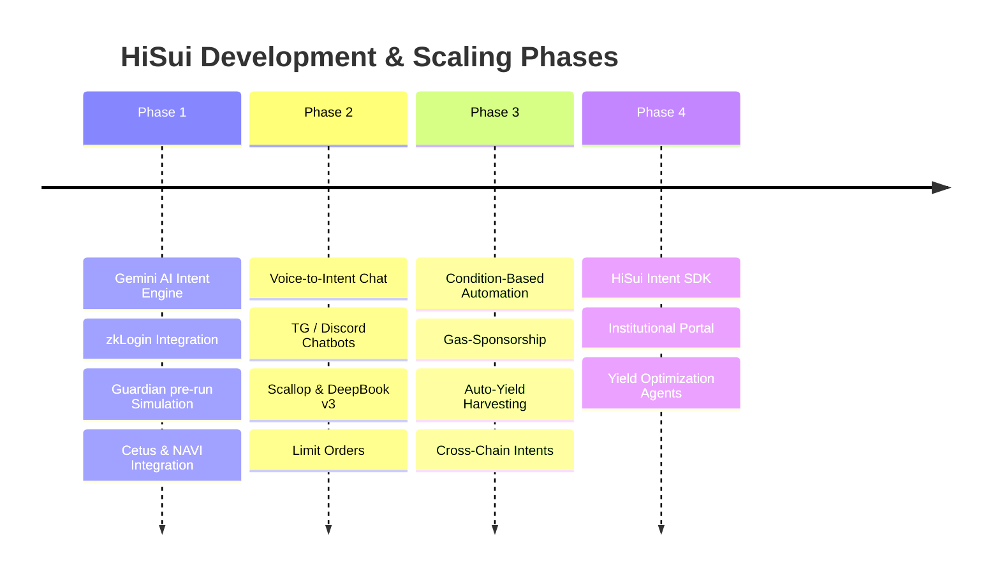

# HiSui | Premium AI Web3 Intent Engine for Sui

<p align="center">
  
</p>

<p align="center">
  <strong>Translate natural language into atomic Programmable Transaction Blocks (PTB) on the Sui blockchain with real-time risk simulation.</strong>
</p>

---

## 💡 The Problem

DeFi on modern blockchains is incredibly powerful but highly fragmented. To execute a simple yield strategy—such as swapping a token on an AMM and depositing it into a lending protocol—a user must:
1. Navigate to a decentralized exchange (DEX), connect a wallet, calculate slippage, and execute a swap.
2. Navigate to a lending market, connect the wallet again, and supply liquidity.
3. Pay multiple gas fees, sign multiple transactions, and navigate confusing UI layouts.
4. Keep track of seed phrases and manage private keys, which creates a high barrier of entry for Web2 users.

## 🚀 The Solution: HiSui

**HiSui** is a premium, conversational **AI Intent Engine** that simplifies blockchain interaction. Users input their goal in plain English, and HiSui does the heavy lifting:

*   **Natural Language to PTB**: Translates conversational prompts (e.g., *"Swap 0.5 SUI for USDC and deposit it in NAVI"*) into structured actions.
*   **Atomic Multi-Protocol Bundling**: Compiles all actions into a single **Programmable Transaction Block (PTB)** that executes in a single click, saving gas and time.
*   **Guardian Simulation Checklist**: Performs a live, on-chain dry-run simulation of the transaction before signing. It checks if the block will succeed, verifies swap rates against the **Pyth Network** oracle, evaluates slippage, and displays safety warnings.
*   **zkLogin Frictionless Onboarding**: Allows users to log in instantly using their Google credentials, abstracting away private keys while maintaining cryptographic security.

---

## ✨ Core Features

*   **Google zkLogin Integration**: On-chain wallets created instantly using Web2 Google Auth, featuring dynamic ZK proof generation and salt cache management.
*   **AI Intent Compiler**: Integrated with **Google Gemini AI** to dynamically map text prompts into structured blockchain execution schemas.
*   **Guardian Safety Shield**: Real-time simulation log checking for contract execution success, price manipulation, and slippage warnings.
*   **DeFi Integrations**:
    *   **Cetus Protocol**: Deep liquidity routing for instant token swaps.
    *   **NAVI Protocol**: Direct deposits into SUI/USDC lending pools.
*   **Connected Wallet Card**: Sleek dashboard widget displaying connection status (zkLogin or browser extension) and live token balances (SUI, USDC, USDT, DEEP, CETUS).
*   **Premium Brand Identity**: A pure black, high-contrast, fully responsive dashboard built with custom glassmorphic panels and a live pulsing composer.

---

## 🛠️ Tech Stack

*   **Frontend**: React (Vite), TypeScript, Tailwind CSS (v4).
*   **Sui SDKs**: `@mysten/sui` (TypeScript SDK), `@mysten/dapp-kit` (Sui dApp Kit).
*   **Oracles & DeFi**:
    *   **Pyth Network SDK**: Real-time SUI/USD asset price feeds.
    *   **Cetus SDK**: Swap router integration.
    *   **NAVI Lending SDK**: Supplying assets to lending pools.
*   **AI & Backend**:
    *   **Google Gemini API**: Generative AI NLP engine.
    *   **Express**: Secure backend proxy server for API key isolation and proof coordination.

---

## 📂 Project Structure

```bash
HiSui/
├── public/                 # Static assets (logo, favicon, mascot droplet)
├── server/
│   └── index.js            # Express backend proxy for API keys and zkLogin
├── src/
│   ├── services/
│   │   ├── oauth.ts        # OAuth flow coordination for Google zkLogin
│   │   ├── zkLogin.ts      # Proof handling, 16-byte salt, and session derivation
│   │   ├── intentParser.ts # System prompt and Gemini AI translation schemas
│   │   ├── ptbBuilder.ts   # Case-preserving PTB compiler (Cetus swap & NAVI supply)
│   │   └── guardian.ts     # Dry-run simulator and Pyth oracle price checks
│   ├── App.tsx             # Main chat view, wallet status, and modal forms
│   ├── index.css           # Styling theme variables (Sui.io branding colors)
│   └── main.tsx            # React application mount point
├── package.json
└── vite.config.ts          # Proxy rules and server mappings
```

---

## 🚀 Setup & Installation

### Prerequisites
*   Node.js (v18+)
*   npm or yarn

### 1. Clone the Repository
```bash
git clone https://github.com/Mrgtee/HiSui.git
cd HiSui
```

### 2. Configure Environment Variables
Create a `.env` file in the root directory:
```env
# Frontend Config
VITE_NETWORK=testnet

# Backend Security Keys (Configured in Railway)
VITE_BACKEND_URL=http://localhost:3001
PORT=3001
GEMINI_API_KEY=your_google_gemini_api_key
VITE_GOOGLE_CLIENT_ID=your_google_oauth_client_id
```

### 3. Install Dependencies
```bash
npm install
```

### 4. Run Development Server
Start the Express backend proxy and Vite dev server:
```bash
# Start backend proxy
node server/index.js

# Start frontend (in a separate terminal)
npm run dev
```

---

## 💡 Example Intents

Try entering the following commands in the chat box:
*   `"Swap 1 SUI for USDC"`
*   `"Deposit 5 SUI into NAVI"`
*   `"Swap 0.5 SUI for USDC and deposit it in NAVI"`
*   `"Transfer 1 SUI to 0x3898ff..."`

---

## 🗺️ Project Roadmap



### 📍 Phase 1: MVP Core Foundation (Current)
*   Integrate Gemini NLP, zkLogin Google session, and dry-run Guardian checker.
*   Implement multi-step atomic PTBs linking Cetus and NAVI protocol actions.

### 📍 Phase 2: Conversational Voice & Ecosystem Integrations (Q3 2026)
*   **Voice-to-Intent Command Parsing**: Integrate the Web Speech API to allow users to dictate transactions directly (e.g., clicking a microphone icon and speaking their intent).
*   **Expand Integrations**: Support **DeepBook v3** (limit orders) and **Scallop** (lending pools).
*   **Chatbots**: Release HiSui Telegram and Discord bots for conversational wallet interactions.

### 📍 Phase 3: Condition-Based Automation (Q4 2026)
*   Enable automated triggers (e.g., *"If SUI price hits $1.80, swap 100 USDC for SUI"*).
*   Implement zero-gas transaction sponsorship via Sui gas stations.

### 📍 Phase 4: B2B SDK Layer (Q1 2027)
*   Package the NLP-to-PTB engine as an open-source Developer SDK for other dApps.
